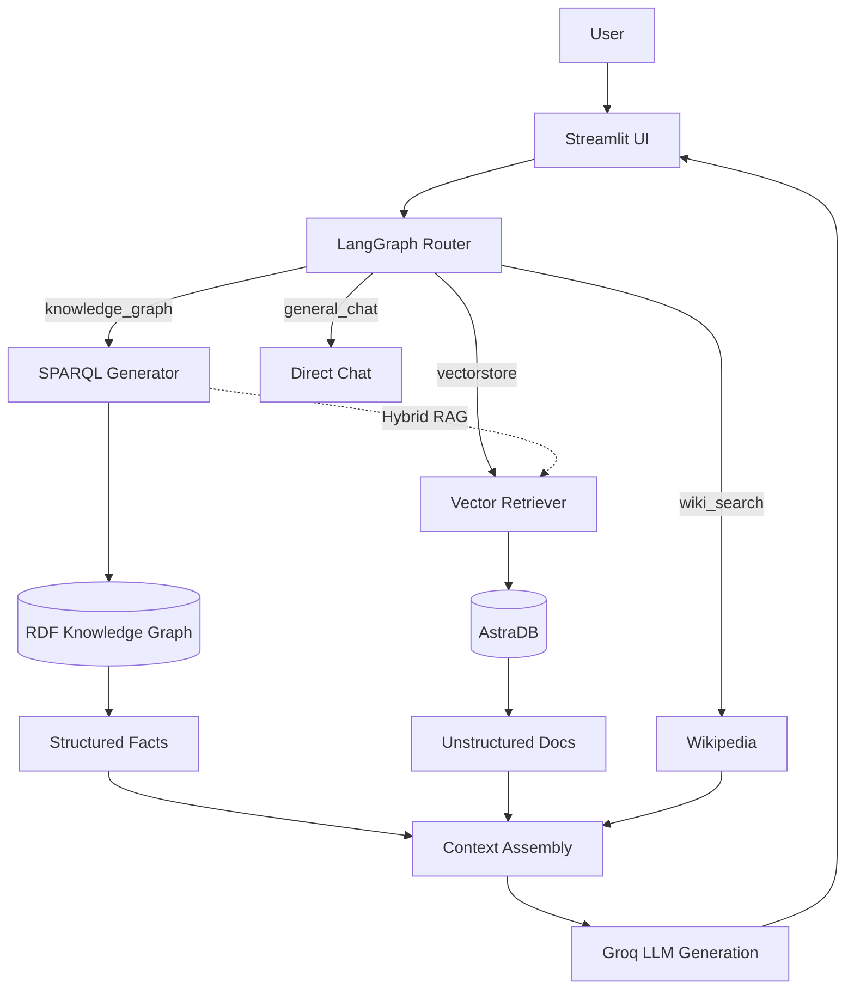

# Multi-Agent Clinical Knowledge Graph RAG System

An agentic retrieval-augmented chat system that routes user queries to the right execution path (Vectorstore, Knowledge Graph, or Web), retrieves context, and answers through a LangGraph-orchestrated workflow.

This project specifically integrates a **Semantic Knowledge Graph** to answer structured clinical trial questions alongside unstructured document retrieval, demonstrating agentic AI capabilities for pharmaceutical research and development.

---

## 🏥 Clinical Use Case & Problem Statement

**Problem:** In clinical operations, teams often need to query both unstructured documents (protocols, PDFs) and structured relational data (which trials study what condition, what drug, in what phase). Traditional vector RAG struggles with exact relational queries (e.g., "Which Phase 3 trials study Diabetes?").

**Solution:** A Multi-Agent System that intelligently routes queries:
- **Unstructured questions** → Vector Database (AstraDB)
- **Structured relational questions** → Clinical Knowledge Graph (RDF/OWL/SPARQL)
- **General knowledge** → Wikipedia
- **Small talk** → Direct Chat

This architecture accelerates drug development by equipping clinical teams with advanced tools to query trial metadata semantically.

---

## 🧠 RDF / OWL / SPARQL Roles

- **RDF (Resource Description Framework):** Used to represent clinical trial data as triples (Subject -> Predicate -> Object). Example: `TrialA -> hasIntervention -> Metformin`.
- **OWL (Web Ontology Language):** Defines the formal clinical ontology (Classes: `ClinicalTrial`, `Drug`, `Condition`, `Phase`, `Outcome` and Properties: `hasIntervention`, `studiesCondition`, etc.).
- **SPARQL:** A semantic query language used by the AI agent to exactly retrieve facts from the knowledge graph based on user questions.

---

## 🗺️ Graph Schema

```text
ClinicalTrial
 ├── hasIntervention ──> Drug
 ├── studiesCondition ──> Condition
 ├── hasPhase ──> Phase
 └── hasOutcome ──> Outcome
```
*All entities have human-readable string labels attached via `rdfs:label`.*

---

## 🛠️ Architecture



---

## 🔍 Example SPARQL Query
When a user asks: *"Which Phase 3 trials study Diabetes?"*
The agent dynamically generates:
```sparql
PREFIX clin: <http://example.org/clinical#>
PREFIX rdfs: <http://www.w3.org/2000/01/rdf-schema#>

SELECT ?trialLabel ?drugLabel
WHERE {
  ?trial a clin:ClinicalTrial ;
         rdfs:label ?trialLabel ;
         clin:hasPhase ?phase ;
         clin:studiesCondition ?condition ;
         clin:hasIntervention ?drug .
  ?phase rdfs:label "Phase 3" .
  ?condition rdfs:label "Type 2 Diabetes" .
  ?drug rdfs:label ?drugLabel .
}
```

---

## 💬 Sample Questions to Try
1. **Knowledge Graph:** "Which Phase 3 trials study Diabetes?"
2. **Knowledge Graph:** "What is the primary outcome of the trial testing Pembrolizumab?"
3. **Vectorstore:** "What is prompt engineering?"
4. **Wiki Search:** "Who invented the internet?"
5. **Chat:** "Hello! 👋"

---

## 🚀 Setup & Installation

1. **Clone Repository:**
   ```bash
   git clone <repo_url>
   cd multi-agent-rag
   ```
2. **Virtual Environment:**
   ```bash
   python -m venv .venv
   source .venv/bin/activate
   pip install -r requirements.txt
   ```
3. **Credentials:** Get a Groq API Key and AstraDB Token.
4. **Run Application:**
   ```bash
   streamlit run app.py
   ```

---

## 🧪 Testing & Limitations
- **Testing:** The routing and graph logic are handled by LangGraph state transitions. The SPARQL queries are generated on the fly by the LLM. 
- **Limitations:** The agent relies on zero-shot SPARQL generation, which works well for simple ontologies but may require few-shot prompting for complex, highly nested real-world clinical schemas.

---

## ⚠️ Data Privacy Note
**DOMAIN SAFETY:** This is a portfolio/academic research project. **No real patient data is used.** The clinical knowledge graph operates on a small, synthetic dataset created purely for demonstration purposes. This system is not a clinical decision-making tool.
